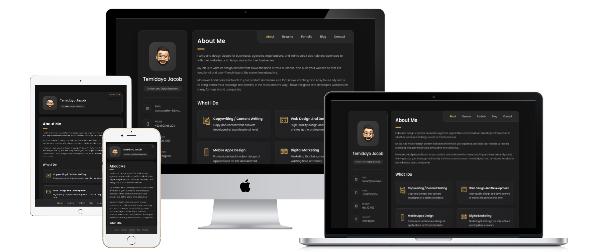

# vCard - Personal portfolio


[](https://twitter.com/intent/follow?screen_name=temidayoxyz)

vCard is a fully responsive personal portfolio website, responsive for all devices, built using HTML, CSS, and JavaScript.

## Inspiration


## Demo




## Requirements

Before you begin, ensure you have met the following requirements:

* [Git](https://git-scm.com/downloads "Download Git") must be installed on your operating system.
* Knowledge of HTML, CSS, and JavaScript
* A brain to think 🤓🤓

## Installing vCard

To install **vCard**, follow these steps:

Linux and macOS:

```bash
sudo git clone https://github.com/temidayoxyz/vCard.git
```

Windows:

```bash
git clone https://github.com/temidayoxyz/vCard.git
```

## Contact

If you want to contact me you can reach me at [Twitter](https://www.twitter.com/temidayoxyz).

## License

This project is **free to use** and does not contains any license.
